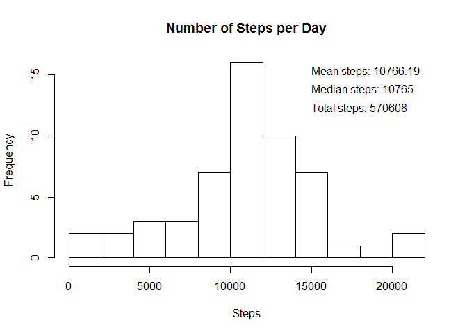
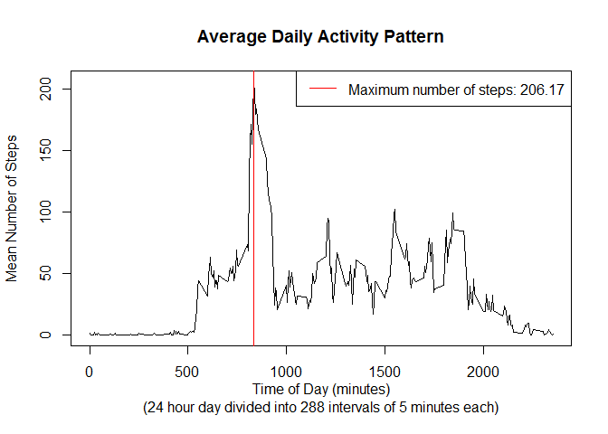
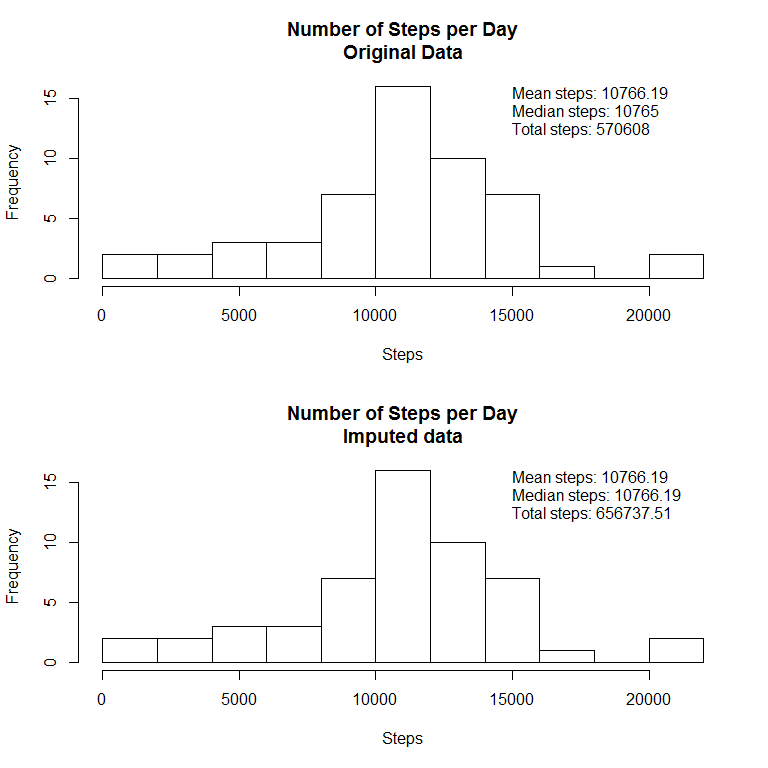

# Reproducible Research: Peer Assessment 1


## Loading and preprocessing the data

There does not seem to be any preprocessing required at this stage.

```r
data <- read.csv("activity.csv")
```


## What is mean total number of steps taken per day?
  

```r
by_date <- aggregate(steps ~ date, data, sum)
mno <- round(mean(by_date$steps), digits = 2)
mdo <- round(median(by_date$steps), digits = 2)
toto <- round(sum(data$steps, na.rm = TRUE), digits = 2)
hist(by_date$steps, breaks = 10, main = "Number of Steps per Day", xlab = "Steps")
text(15000, 15, labels = paste("Mean steps:", as.character(mno)), adj = c(0,0))
text(15000, 13.5, labels = paste("Median steps:", as.character(mdo)), adj = c(0,0))
text(15000, 12, labels = paste("Total steps:", as.character(toto)), adj = c(0,0))
```

 


## What is the average daily activity pattern?

```r
by_interval <- aggregate(steps ~ interval, data, mean)
with(by_interval, plot(steps ~ interval, type = "l",
                       main = "Average Daily Activity Pattern",
                       xlab = "Time of Day (minutes)\n(24 hour day divided into 288 intervals of 5 minutes each)",
                       ylab = "Mean Number of Steps"))
with(by_interval, abline(v = by_interval$interval[which.max(by_interval$steps)], col = "red"))

mx <- round(max(by_interval$steps), digits = 2) # The maximum average number of steps
mx
```

```
## [1] 206.17
```

```r
which.max(by_interval$steps) # The index of the interval with the maximum
```

```
## [1] 104
```

```r
by_interval$interval[which.max(by_interval$steps)] # The interval with the maximum
```

```
## [1] 835
```

```r
library(lubridate)
seconds_to_period(by_interval$interval[which.max(by_interval$steps)]*60) # The interval converted to "normal" time
```

```
## [1] "13H 55M 0S"
```

```r
legend("topright", legend = paste("Maximum number of steps:", mx), lty = 1, col = "red")
```

 


## Imputing missing values

It appears that when missing values occur, the whole day is missing.
I am therefore using the interval mean to fill in NAs.


```r
data_imputed <- data
sum(is.na(data_imputed$steps)) # Calculate number of missing values
```

```
## [1] 2304
```

```r
NA_index <- is.na(data_imputed$steps) # Find indices of NAs
for (i in which(NA_index)) { # Replace NAs with interval mean
  data_imputed$steps[i] <- by_interval[by_interval$interval == data_imputed$interval[i], "steps"]
}
sum(is.na(data_imputed$steps)) # Calculate number of missing values after replacement
```

```
## [1] 0
```

```r
par(mfrow = c(2, 1))
# Plot original data as previously
hist(by_date$steps, breaks = 10, main = "Number of Steps per Day\nOriginal Data", xlab = "Steps")
text(15000, 15, labels = paste("Mean steps:", as.character(mno)), adj = c(0,0))
text(15000, 13.5, labels = paste("Median steps:", as.character(mdo)), adj = c(0,0))
text(15000, 12, labels = paste("Total steps:", as.character(toto)), adj = c(0,0))

# Plot imputed data
by_date_imputed <- aggregate(steps ~ date, data_imputed, sum)
mni <- round(mean(by_date_imputed$steps), digits = 2)
mdi <- round(median(by_date_imputed$steps), digits = 2)
toti <- round(sum(data_imputed$steps), digits = 2)
hist(by_date$steps, breaks = 10, main = "Number of Steps per Day\nImputed data", xlab = "Steps")
text(15000, 15, labels = paste("Mean steps:", as.character(mni)), adj = c(0,0))
text(15000, 13.5, labels = paste("Median steps:", as.character(mdi)), adj = c(0,0))
text(15000, 12, labels = paste("Total steps:", as.character(toti)), adj = c(0,0))
```

 

The mean stays the same but the median and total changes.  
This makes sense considering the interval mean was used to impute data.

## Are there differences in activity patterns between weekdays and weekends?


```r
# Convert dates to weekdays ($day).
data_imputed$date <- ymd(data_imputed$date)
data_imputed$day <- weekdays(data_imputed$date)
# Convert day to "weekday" or "weekend"
data_imputed$daytype <- "weekday"
for (i in which(data_imputed$day %in% c("Saturday", "Sunday"))) {
  data_imputed$daytype[i] <- "weekend"
}
# Convert daytype to factor
data_imputed$daytype <- as.factor(data_imputed$daytype)

# Summarize steps by interval and weekday vs. weekend
by_int_and_daytype <- aggregate(steps ~ interval + daytype, data_imputed, mean)

# Plotting with lattice
library(lattice)
xyplot(steps ~ interval | daytype, data = by_int_and_daytype, layout = c(1,2), type = "l")
```

 

